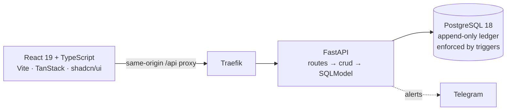

# CastraNova POS

Inventory tracking and point-of-sale for a business that sells both serial-numbered equipment and batch-tracked parts — with FIFO costing, an append-only audit ledger, and an offline-tolerant shop floor.

[](LICENSE)
[](https://www.python.org/)
[](https://fastapi.tiangolo.com)
[](https://react.dev)
[](https://www.postgresql.org)

---

## What it does

Every product is tracked one of two ways, and that choice drives the whole system:

| | **SERIALIZED** | **QUANTITY** |
|---|---|---|
| Identified by | a per-unit barcode | the SKU |
| Cost basis | that unit's own purchase cost | FIFO across batches |
| Moves | one piece at a time | any quantity, drawn oldest-first |

**Stock in and out**
Receive serialized pieces or costed batches · barcode-scan lookup resolving serial → unit and SKU → part · sale checkout with per-line pricing overrides · customer returns that restore FIFO stock *and* reverse revenue at the batch cost actually drawn · admin stock adjustments for loss and found stock.

**Work that consumes stock**
Service tickets drawing repair parts · project pulls with per-line fulfilment and FIFO batch attribution back to the project.

**Money and reporting**
Channel margin grouped by channel, product, customer or project · inventory holding period · pricing-override exceptions · price-change history showing who changed what and when · PDF and Excel export.

**Operations**
Low-stock alerts with per-product thresholds · Telegram notifications with self-enrolment by one-time code · an offline mutation queue, with a sync-review queue for write conflicts · role-tiered access · append-only audit trail.

---

## Quickstart

**Prerequisites** — Docker with Compose. [Bun](https://bun.sh) as well, if you want to run frontend tooling outside the container.

```bash
git clone https://github.com/Waiphyoaung24/CastraNova-pos.git
cd CastraNova-pos
cp .env.example .env
```

Set three secrets in `.env` before starting — generate each one separately:

```bash
python -c "import secrets; print(secrets.token_urlsafe(32))"
# -> SECRET_KEY, POSTGRES_PASSWORD, FIRST_SUPERUSER_PASSWORD
```

```bash
docker compose watch
```

| Service | URL |
|---|---|
| Frontend | http://localhost:5173 |
| API + docs | http://localhost:8000/docs |
| Mailcatcher | http://localhost:1080 |
| Adminer | http://localhost:8080 |
| Traefik dashboard | http://localhost:8090 |

Sign in as `FIRST_SUPERUSER`. The `prestart` service runs `alembic upgrade head` and seeds the superuser, locations and system settings before the API accepts traffic.

> Use `docker compose watch`, not `up`. `up` serves the code baked into the image, so your edits — and your tests — can silently run against stale source.

---

## Architecture



The frontend never writes SQL, and routes never call `session.exec`. All database access goes through `crud.py` — the single place FIFO consumption and ledger writes happen.

```
backend/app/
  api/routes/      one file per resource
  api/deps.py      SessionDep, CurrentUser, admin guards
  crud.py          ALL database reads and writes
  models.py        SQLModel tables + Create/Update/Public schemas
  alembic/         41 migrations, head m036
  core/            config, security, db engine
frontend/src/
  routes/_layout/  TanStack file-based routes
  components/      shadcn/ui primitives + app components
  client/          AUTO-GENERATED SDK — never hand-edit
  lib/             pure, unit-testable logic (cart, returns, reports, auth)
```

---

## Rules a contributor must not break

**Stock movements are append-only.** `unitmovement`, `partmovement`, `costline`, `pricechange` and `notificationlog` carry triggers that reject `UPDATE` and `DELETE` outright (migration m021). Never mutate a stock total — insert a movement row and derive it. This is enforced in Postgres, not Python, so routing around it in application code simply fails.

**Money is `Numeric(12,2)` end to end.** Costs and prices stay strings across the frontend boundary and are parsed only at the validation edge, so no monetary value passes through a float.

**Every schema change needs a migration.** Run `alembic revision --autogenerate -m "..."`, then read what it generated before committing it.

**Regenerate the SDK after any backend schema change** — `bun run generate-client`. `frontend/src/client/` and `routeTree.gen.ts` are generated; hand-edits get overwritten.

**Mutations carry idempotency keys.** The shop floor goes offline and replays queued writes. A retry must never produce a second sale.

---

## Testing

| Suite | Command | Requires |
|---|---|---|
| Backend | `bash scripts/test.sh` | Docker stack |
| Frontend unit | `bun run test:unit` *(in `frontend/`)* | nothing — pure logic |
| End-to-end | `bun run test` *(in `frontend/`)* | full stack + browser |

> **These suites destroy data.** The backend tests truncate every domain table in the database they run against, and E2E's `global.setup.ts` truncates and reseeds by default. Set `E2E_SKIP_DB_RESET=1` unless you actually want your development data gone. There is no demo-seed script to restore it.

Pre-commit runs `prek`, `biome`, `ruff` and `mypy --strict`. All must pass.

---

## Branch model

```
feature ──PR──> dev ──merge──> production
                 │
                 └──fast-forward──> master   (default branch, mirror only)
```

`dev` is the trunk — open pull requests against it. Release by merging `dev` into `production`. `master` is the GitHub default branch, kept fast-forwarded from `dev` so the repository landing page shows the real project; never commit to it directly.

> `master` tracked the upstream `full-stack-fastapi-template` untouched until 2026-08-03, which is what allowed `copier update` to pull template fixes. It was fast-forwarded from `dev` on that date, so `copier.yml` and `.copier/` remain in the tree but no longer function.

Workflow files exist under `.github/`, but **no workflow has ever run on this repository**. A clean merge state means nothing was checked — not that checks passed. Review and test locally before merging.

Further reading: [CONTRIBUTING.md](CONTRIBUTING.md) · [development.md](development.md) · [deployment.md](deployment.md) · [CLAUDE.md](CLAUDE.md)

---

## License

MIT — see [LICENSE](LICENSE).

Built on [full-stack-fastapi-template](https://github.com/fastapi/full-stack-fastapi-template). The `LICENSE` file still carries that project's original copyright notice; update it if you intend to assert your own.
