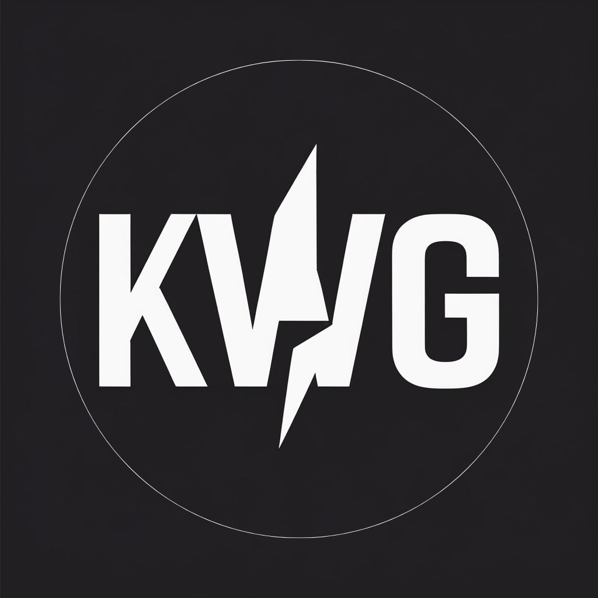

  

# CastraNova POS — Project Quotation

**Quotation Reference:** KWG-CN-2026-0602-Q2
**Date:** 2 June 2026
**Valid until:** 2 July 2026 (30 days)
**Prepared by:** K W G
**Prepared for:** CastraNova (Bangkok HQ + Yangon Warehouse)
**Scope artifact:** PRD v3.0 — [2026-06-02-castranova-pos-v3.0-prd.md](2026-06-02-castranova-pos-v3.0-prd.md)

> *This quotation supersedes the prior internal draft KWG-CN-2026-0602-Q1. It reflects the locked PRD v3.0 scope, the two-milestone payment structure, and Thailand-procured hardware references.*

---

## 1. Executive Summary

KWG will design, build, deploy, train on, and support **CastraNova POS v1** — a barcode-tracked inventory and channel-margin reporting system spanning Bangkok HQ administration and Yangon warehouse operations — per the locked scope in **PRD v3.0** (FR-001 through FR-020).

**This engagement also includes a small AI integration** that complements the core workflow — exact feature scoped at contract signing.

**Total fee: $1,000 USD (≈ ฿35,000 THB), all-in, fixed-price.**
Payment in two milestones: 50% upfront + 50% on delivery.
Timeline: two to four weeks from contract signing to go-live.

The fee covers all twenty functional requirements, the AI integration, deployment, parallel run, one day of on-site training per office, and 30 calendar days of post-launch bug-fix support. After the first 30 days, an optional monthly SLA at ฿5,000 / month is available for continuing bug-fix and minor-support coverage.

---

## 2. Scope

The complete functional and non-functional scope is defined in **PRD v3.0** ([2026-06-02-castranova-pos-v3.0-prd.md](2026-06-02-castranova-pos-v3.0-prd.md)). This quotation is priced against the v3.0 scope **as locked on 2 June 2026**. Any change after this date is a change order (see §9).

**In-scope summary:**

| Area | What's delivered |
|---|---|
| Catalog & master data | Product catalog · Per-product pricing with FIFO cost tracking · Suppliers, customers, projects · User & role management |
| Receiving at Yangon | Serialized receiving (machines + high-value parts) · Commodity-parts receiving with FIFO batches |
| Consumption | Sale · On-site maintenance (recorded at warehouse) · Project Pull workflow · Pricing overrides with approval queue |
| Inventory management | Admin-only Stock Adjustment (FIFO-aware) |
| Reports & dashboards | Stock-on-hand · Monthly channel margin · Holding period · Search & lookup · Low-stock alerts · PDF + Excel exports |
| Notifications | LINE + Viber operational alerts with per-user opt-in |
| Audit & compliance | Append-only audit trail with dual-actor tagging on Project Pulls |
| Analytics | Customer detail dashboard · Project detail dashboard · Role-tiered access |
| **AI integration** | **Small AI-powered feature complementing the workflow — specific capability finalized at contract signing** |

---

## 3. Deliverables

At end of engagement, CastraNova receives:

- A working **web application** accessible from Bangkok HQ and the Yangon warehouse, running on the CastraNova-owned Hostinger VPS
- All **source code** transferred to a CastraNova-owned private GitHub repository
- **Deployment** to production with HTTPS, daily database backups, and a tested restore procedure
- **One-time catalog seed import** from CastraNova's existing CSV / Excel product list
- **LINE and Viber bot setup** for the first ten user accounts
- **Bluetooth barcode scanner field tuning** on the reference scanner models (see §5)
- **Two-week parallel run** with existing spreadsheets before retirement
- **One day of on-site training** at each office (Bangkok HQ + Yangon warehouse)
- **30 calendar days of post-launch bug-fix support** at no additional charge
- **Operations runbook** covering user onboarding, label printer setup, and routine admin tasks

---

## 4. Price & Payment

**Total project fee: $1,000 USD (≈ ฿35,000 THB)**, fixed-price, all-in for the scope above.

Exchange rate is indicative at approximately 35 THB per USD. Actual conversion handled by CastraNova's bank at payment time.

### Payment schedule

| Milestone | Trigger | Amount |
|---|---|---|
| **Mobilization (50%)** | Quotation acceptance signed + PRD v3.0 sign-off | **$500 USD** (≈ ฿17,500 THB) |
| **Delivery (50%)** | Production cutover + start of parallel run | **$500 USD** (≈ ฿17,500 THB) |
| **Total** | | **$1,000 USD** (≈ ฿35,000 THB) |

**Terms:**
- Invoices issued on milestone trigger; payable net 14 days.

---

## 5. Hardware & Hosting (Client-Owned, Not in Project Fee)

The items below are **CastraNova's procurement responsibility** and are **not included** in the $1,000 project fee. KWG will assist with initial setup but does not procure or invoice for the hardware. All prices are indicative — confirm with the listed vendors before purchase.

### 5.1 Bluetooth Barcode Scanners

| Item | Use | Indicative price | Vendor |
|---|---|---|---|
| **TYSSO BCP-2DC Bluetooth scanner** (1D + 2D, HID mode) | Primary scanner — Yangon warehouse | ~฿4,500 each | [POSPAK Thailand](https://www.pospak.com/en/barcode-scanner) · Shop4Thai |
| **Posiflex CD-3870 Bluetooth scanner** (1D, HID mode) | Backup unit | ~฿3,800 each | [Posiflex Thailand distributor](https://barcodeprinterthailand.com/Posiflex-b11/) |

Both models operate as keyboard wedges over Bluetooth HID — staff scans into a focused field on screen. KWG QAs against both reference models during deployment. Other HID-mode scanners may work but are supported on best-effort only.

**Suggested quantity:** 1× TYSSO + 1× Posiflex = ฿8,300 one-time.

### 5.2 Label Printer & Consumables

| Item | Use | Indicative price | Vendor |
|---|---|---|---|
| **TSC TDP-225** (2-inch desktop direct thermal label printer, USB) | Warehouse label printing at serialized receipt | ~฿8,500 | [BARIGAN Thailand](https://barigan.com/product-category/thermal-label-printer/) · [PM Labels](https://www.pmlabels.com/thermal-transfer/thailand) |
| **Direct thermal label rolls** (4×6 in, 200 count, compatible with TSC TDP-225) | Consumable | ~฿300 per roll · estimated 4 rolls per year | Local label suppliers |

**Suggested first-year outlay:** ฿8,500 printer + ฿1,200 labels = ฿9,700.

### 5.3 Hosting (Hostinger KVM 8 VPS, Singapore region)

CastraNova will subscribe to **Hostinger KVM 8** ([www.hostinger.com](https://www.hostinger.com)). KWG provisions and configures the server during deployment; the subscription is in CastraNova's name.

| Cost item | First year (promo) | Year 2 onward (renewal) |
|---|---|---|
| Hostinger KVM 8 VPS (8 vCPU / 16 GB RAM / 100 GB SSD) | $341.88 (12-month promo @ $28.49/mo) | $647.88 / yr (renewal @ $53.99/mo) |
| Domain registration (e.g. `pos.castranova.com`) | $0 (free with VPS first year) | ~$13 / yr |
| Taxes | ~$24 | ~$45 |
| **Total** | **~$365.81 ≈ ฿12,800** | **~$706 ≈ ฿24,700 / yr** |

⚠️ **Year 2 cost roughly doubles** when the promotional rate ends. CastraNova may want to lock in a 24-month plan at signup for further savings (a one-click option on the Hostinger cart). KWG can advise but does not pay the subscription.

**Optional add-on:** Hostinger Daily Auto-Backup at $24/mo (~฿840/mo). Pairs with KWG's daily `pg_dump` backup for redundancy. KWG recommends but does not require.

### 5.4 LINE Messaging API & Viber Bot

| Item | Indicative price | Owner |
|---|---|---|
| LINE Messaging API channel | Free tier (500 push messages / month included) | CastraNova-owned |
| Viber Bot account | Free | CastraNova-owned |

CastraNova owns the channel access tokens; KWG configures the integration during deployment.

### 5.5 Client-owned cost summary (indicative)

| Bucket | One-time | First-year recurring | Renewal recurring |
|---|---|---|---|
| Scanners (1× TYSSO + 1× Posiflex) | ~฿8,300 | — | — |
| Label printer (TSC TDP-225) | ~฿8,500 | — | — |
| Label rolls (4 rolls / year est.) | — | ~฿1,200 | ~฿1,200 |
| Hostinger KVM 8 + domain + tax | — | ~฿12,800 | **~฿24,700** |
| LINE / Viber | — | ฿0 | ฿0 |
| **Subtotal** | **~฿16,800** | **~฿14,000** | **~฿25,900** |

---

## 6. Post-Launch Support

### 6.1 Included — First 30 calendar days post go-live (no additional charge)

- Bug fixes for any defect traceable to the PRD v3.0 scope
- Hot-fix deployment via the same Hostinger pipeline
- **SLA — Critical issues** (system unavailable, data loss, security): response within 4 hours, fix within 1 business day
- **SLA — Non-critical issues**: response within 1 business day, fix within 5 business days

### 6.2 Optional — Monthly Service Level Agreement (from month 2 onward)

After the 30-day included window, CastraNova may opt into a continuing monthly SLA:

| Item | Price | What's covered |
|---|---|---|
| **Monthly SLA** | **฿5,000 / month** | Bug-fix support · monthly system health check · LINE / Viber bot enrollment for new users · admin runbook updates as the system evolves · same response SLAs as §6.1 |

**Terms of the monthly SLA:**
- Three-month minimum commitment if opted in.
- Billed monthly; invoiced at the start of each month, payable net 14 days.
- Does **not** include new features or scope changes beyond PRD v3.0 — those are change orders (§9).
- 30 days written notice from either side to terminate.

CastraNova is not obligated to opt in. If no SLA is purchased, post-month-1 support is handled ad-hoc — KWG and CastraNova agree on a price per request before any work starts.

---

## 7. Assumptions & Exclusions

### 7.1 Assumptions (a material change to any of these is a change order)

1. **PRD v3.0 is the locked scope** as of 2 June 2026.
2. CastraNova provides the existing product catalog (CSV / Excel) within the first week of mobilization.
3. CastraNova nominates a **primary product owner** (Bangkok admin) available for ~4 hours / week of review and sign-off during the engagement.
4. CastraNova procures the reference scanners (TYSSO + Posiflex), label printer (TSC TDP-225), and label rolls before deployment.
5. CastraNova subscribes to **Hostinger KVM 8** in CastraNova's own account before deployment.
6. CastraNova users are reachable on LINE and / or Viber for the one-time bot enrollment.
7. Phase sign-off and feedback turnarounds within 3 business days. Delayed sign-off does not delay invoicing.

### 7.2 What's NOT included in the $1,000 fee

- Hardware (scanners, label printer, label rolls)
- Hosting subscription (Hostinger VPS, domain, optional auto-backup)
- LINE Messaging API charges beyond the free tier
- Customer-facing legal tax documents
- Warranty start / end tracking per unit
- Multi-currency or multi-language support
- Native mobile app (the web app runs on phones as a backup)
- Direct integration with accounting or tax systems (reports export to PDF + Excel for hand-off)

For a complete list of v1 exclusions, see PRD v3.0 §9.

---

## 8. Warranty

KWG warrants the delivered software to perform per the PRD v3.0 acceptance criteria for **90 calendar days post-delivery**. Within the warranty window, KWG will fix defects (deviations from PRD acceptance criteria) at no additional charge.

**Warranty excludes** defects caused by:
- Hardware failure (scanners, printer, server hardware)
- Third-party service outage or behavior changes (Hostinger, LINE, Viber, label printer drivers)
- CastraNova-side data entry errors or unauthorized code modifications
- Use outside the documented operational scope

---

## 9. Change Orders

Any change to PRD v3.0 scope after 2 June 2026 follows this process:

1. CastraNova requests a change in writing.
2. KWG provides a written impact assessment within 3 business days, covering scope, effort, calendar impact, and a proposed price for the change.
3. CastraNova approves the proposed price in writing.
4. KWG begins work after approval; the change order amount is invoiced separately from the main project fee.

Each change order is priced **by mutual agreement** between KWG and CastraNova — typically as a flat fee per change. No standing day rate is set in advance.

---

## 10. IP, Confidentiality & Termination

### 10.1 Intellectual Property
All source code and deliverables become **CastraNova's property upon final payment** of the $1,000 engagement total. Until final payment, KWG retains all IP rights. KWG retains the right to reuse generic patterns (architectural approaches, reusable utilities) in future engagements; no client-specific business logic, schemas, or data is reused.

### 10.2 Confidentiality
KWG treats all CastraNova business data (catalog, customer lists, prices, margins) as confidential. KWG does not retain copies of production data after the engagement ends. A standard mutual NDA can be attached on request.

### 10.3 Termination
- **For cause (either party):** 30 days written notice for material breach uncured within the notice period. Settlement covers work completed to date at pro-rata price.
- **For convenience (CastraNova):** Settlement covers the upfront mobilization payment plus any pro-rata work completed since.
- **Source code transfer on termination:** KWG transfers all work to date in a private GitHub repo handover within 5 business days of effective termination, regardless of cause.

---

## 11. Validity & Acceptance

- This quotation is valid for **30 days** from the date above (2 June 2026 → 2 July 2026).
- **Acceptance:** sign and date the signature block below, or issue a purchase order referencing **KWG-CN-2026-0602-Q2**.
- Engagement starts on the first business day after KWG receives (a) signed acceptance and (b) the 50% mobilization payment.

---

## 12. Signatures

**For K W G:**

Name: ______________________
Title: ______________________
Signature: ______________________
Date: ______________________

**For CastraNova:**

Name: ______________________
Title: ______________________
Signature: ______________________
Date: ______________________

---

*This quotation incorporates PRD v3.0 (locked 2 June 2026) by reference. In case of conflict between this quotation and PRD v3.0, PRD v3.0 governs scope; this quotation governs commercial terms.*
