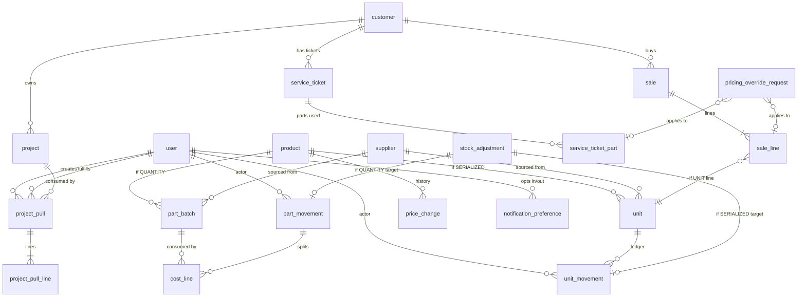

# CastraNova-POS — System Design Spec

**Date:** 2026-06-04
**Status:** Revised against **PRD v3.0** (client-facing) + **PRD v2.6** (engineering-locked) — supersedes the v2.5-based revision
**Scope:** Implementation reference for [PRD v3.0](../../client/2026-06-02-castranova-pos-v3.0-prd.md) (client-facing, FR-001 → FR-020) and [PRD v2.6](../../client/2026-06-02-castranova-pos-v2.6-prd.md) (engineering contract, Decision Log D1 → D38)
**Stack:** FastAPI ≥0.114, SQLModel ≥0.0.21, Postgres, Alembic, React + Vite + TanStack Router/Query, shadcn/ui, JWT (per [CLAUDE.md](../../../CLAUDE.md))

> **Sources of truth.** [PRD v3.0](../../client/2026-06-02-castranova-pos-v3.0-prd.md) is the **client-facing** source of truth for product-level facts the client signed (hardware models, hosting size, timeline). [PRD v2.6 §11](../../client/2026-06-02-castranova-pos-v2.6-prd.md) is the **engineering** source of truth for internal mechanics (D1–D38). This spec is the source of truth for *implementation* — entity schemas, route shapes, concurrency strategy, migration order. Where v3.0 and v2.6 differ on a client-facing fact, **v3.0 wins** (it is later and is what the client approved); where they differ on internal mechanics, **v2.6 wins**. Spec-layer decisions are labelled **S1–S12** (§12); they renumber the old D32–D38 set per the v2.6 revision-log mandate and add the v3.0/v2.6 alignment decisions.

**Changed in this revision (v2.5 → v3.0/v2.6):** dropped browser-side IndexedDB encryption (S4, was old D35); race-safe `batch_no` generation via Postgres advisory lock (S8, v2.6 D36); device model is **laptop-first / phone-backup** (S10); hosting is **Hostinger KVM 8** (8 vCPU / 16 GB / 100 GB, S9); reference hardware **TYSSO BCP-2DC + Posiflex CD-3870 scanners, TSC TDP-225 printer** (S9, per v3.0 §8.5); explicit performance/scale targets (§6.1); one-time LINE/Viber bot enrollment ops (§6.8, v2.6 D33); a **small AI integration, scope finalized at signing** (§7, S11); rollout aligned to the **2–4 week** client commitment (§11, S12). Library API choices below were verified against current upstream docs via Context7 (TanStack Query offline persistence; vite-plugin-pwa).

---

## 1. Context

CastraNova is a B2B refrigeration trading business: **Bangkok HQ** (administration) + **Yangon** (warehouse + on-site service). The system replaces spreadsheet-and-memory inventory tracking with:

- One barcode per machine and per high-value spare part (SERIALIZED).
- One barcode per commodity SKU with FIFO purchase-batch tracking (QUANTITY).
- Every inventory-out at the YGN warehouse records customer + channel (Sale / Maintenance / Project) + price.
- Bangkok admin initiates Project consumption via Project Pulls; YGN staff fulfills at the warehouse barcode terminal.
- Channel-separated monthly margin reporting; customer/project detail dashboards.
- Offline operation at the YGN warehouse with idempotent sync on reconnect.

**Volume:** 500–700 units/month; 300–500 SKUs in catalog; **10 concurrent users sustained, 20-user peak** (per PRD v3.0 §8.1 / v2.6 §6.1).

---

## 2. Constraints

| Constraint | Value |
|---|---|
| Inventory tracking starts | **YGN warehouse receipt** (BKK procurement and in-transit are out of scope per PRD §9) |
| Tracking granularity — machines + high-value parts | SERIALIZED (one barcode per piece) |
| Tracking granularity — commodity parts | QUANTITY (SKU + FIFO purchase batches) |
| Costing | **FIFO** (no weighted-average; per FR-002 + D23) |
| Users | 2 roles: `BKK_ADMIN`, `YGN_STAFF` (~5 per office) |
| Channels | `SALE`, `MAINTENANCE`, `PROJECT` — Project is admin-only via Project Pull |
| Primary device | **Laptop-first** at both offices; **mobile phone is the backup device** (battery/repair/away-from-terminal). Same browser UI on both (S10, per PRD v3.0 §5) |
| Connectivity | YGN warehouse wifi patchy; mobile-data fallback; offline scanning required; on-site customer visits do **not** require system access |
| Localization | **English-only UI; THB-only currency** in v1 (monetary fields `NUMERIC(12,2)`); no multi-language / multi-currency (PRD v3.0 §8.6 / §9) |
| Stack | FastAPI + SQLModel + Postgres + React/TanStack + shadcn — unchanged from template |
| Hosting | **Hostinger KVM 8 VPS — 8 vCPU / 16 GB RAM / 100 GB SSD, Singapore region** (S9, per PRD v3.0 §8.4) |
| Reference scanners | **TYSSO BCP-2DC** (1D+2D BT HID, primary) + **Posiflex CD-3870** (1D BT HID, backup); other HID scanners best-effort (S9, per PRD v3.0 §8.5) |
| Reference label printer | **TSC TDP-225** (2-in USB direct-thermal, 4×6 rolls, no ribbon) (S9, per PRD v3.0 §8.5) |
| Camera fallback | Phone-camera in-browser scan via `html5-qrcode` when no BT scanner is paired |
| Notifications | LINE Messaging API + Viber Bot API (one-time per-user bot enrollment, §6.8) |
| Exports | PDF (`reportlab`) + Excel (`openpyxl`) for every list view |

---

## 3. Architecture

```
┌──────────────────────────────┐         ┌──────────────────────────────┐
│  Bangkok HQ (admin, online)  │         │  Yangon Warehouse            │
│  ─ laptop (phone backup)     │         │  ─ laptop + BT scanner       │
│  ─ catalog mgmt              │         │    (phone + camera backup)   │
│  ─ Project Pull creation     │         │  ─ scan-receive, sell        │
│  ─ Stock Adjustment          │         │  ─ fulfill Project Pulls     │
│  ─ override approvals        │         │  ─ Maintenance recording     │
└────────────┬─────────────────┘         │  ─ offline-capable PWA       │
             │ HTTPS                      └─────────────┬────────────────┘
             ▼                                          │ HTTPS (wifi or 4G)
     ┌─────────────────────────────────────────────────▼───┐
     │  FastAPI + Postgres                                  │
     │  Hostinger KVM 8 VPS — Singapore (8 vCPU/16GB/100GB) │
     │  ─ JWT auth (2 roles)                                │
     │  ─ append-only unit_movement + part_movement         │
     │  ─ FIFO consumption (SELECT … FOR UPDATE)            │
     │  ─ race-safe batch_no (pg_advisory_xact_lock)        │
     │  ─ Project Pull state machine                        │
     │  ─ idempotency keys on every mutation                │
     │  ─ role-tiered Pydantic *Public schemas              │
     │  ─ Sentry (FE+BE) + 30-day rotated logs              │
     └───────┬──────────────────┬──────────────────┬───────┘
             │                  │                  │
     ┌───────▼──────┐   ┌───────▼───────────┐   ┌──▼──────────────────┐
     │ Barcode +    │   │ Notifications     │   │ Report exporter     │
     │ Receipt PDF  │   │ LINE Msg API +    │   │ PDF (reportlab)     │
     │ (reportlab)  │   │ Viber Bot         │   │ Excel (openpyxl)    │
     └──────────────┘   └───────────────────┘   └─────────────────────┘
```

**Frontend offline (verified via Context7 against current TanStack Query + vite-plugin-pwa docs):**
- React PWA + service worker via `vite-plugin-pwa` with `registerType: 'autoUpdate'`; app shell precached through Workbox `globPatterns`; `virtual:pwa-register/react` `useRegisterSW` drives the offline-ready / update toast.
- TanStack Query mutation queue persisted to **IndexedDB** via `PersistQueryClientProvider` + `createAsyncStoragePersister` (`idb-keyval`), `gcTime: 24h`.
- **`queryClient.setMutationDefaults([...key], { mutationFn })` is mandatory** for every offline-capable mutation so that *paused mutations can resume after a page reload* — without registered defaults a dehydrated mutation has no function to execute on rehydration.
- `queryClient.resumePausedMutations()` runs in the persister's `onSuccess` (after cache restore) and on reconnect; mutations replay in submission order; idempotency keys prevent double-writes.
- Bluetooth scanners pair as HID keyboard wedges and feed keystrokes (terminated by CR) to the focused input; the frontend commits the scan on the terminator and ignores stray keystrokes.

**Rejected alternatives** (carried from prior spec, still valid):
- Local Yangon Postgres replica — overkill at this scale.
- Native mobile app — PWA on phone (backup device) suffices.
- AWS/managed Postgres — VPS is sufficient.

---

## 4. Data Model

### 4.1 Entity-relationship diagram



### 4.2 Entity table (with concrete columns)

All tables use UUID primary keys + `created_at` (`TIMESTAMPTZ NOT NULL DEFAULT now()`) per [CLAUDE.md](../../../CLAUDE.md). `updated_at` only on mutable tables. Append-only tables omit `updated_at` and the app role has `REVOKE UPDATE, DELETE`. All monetary fields are `NUMERIC(12,2)` (per v2.6 §6.4).

| # | Table | Mutable? | Key columns | Notes |
|---|---|---|---|---|
| 1 | `user` | yes | id, email, hashed_pw, role (`BKK_ADMIN`/`YGN_STAFF`), is_active, is_superuser | Existing template table — adds `role` enum for domain authorization. **`is_superuser` is retained** for the template's `/users` + `/items` admin guards and the bootstrap superuser (who gets `role=BKK_ADMIN` **and** `is_superuser=True`); new CastraNova routes authorize via `role` (S7 / `get_admin`) |
| 2 | `notification_preference` | yes | user_id (FK), channel (`LINE`/`VIBER`), event_type, enabled | M2M opt-in; covers FR-018 |
| 3 | `location` | yes (admin) | id, code (unique), name, country, is_active | Flat. Seed rows: `YGN_WH`, `CUSTOMER` (virtual), `ADJUSTED_OUT` (virtual). Extensible to multi-branch in v2 |
| 4 | `supplier` | yes (admin) | id, name, country, contact | Per FR-003 |
| 5 | `customer` | yes (admin + staff inline-create) | id, name, country, contact, type (`DEALER`/`END_CUSTOMER`), notes | Per FR-003; staff can create inline during a sale (FR-007 + D25). v1 tolerates duplicates from offline inline-create; admin merge tool deferred to v1.1 (S3, v2.6 D35) |
| 6 | `project` | yes (admin) | id, code (unique), name, customer_id (FK), start_date, end_date?, status (`ACTIVE`/`CLOSED`), budget_thb? | Per FR-003 |
| 7 | `product` ⭐ | yes (admin) | id, sku (unique), model_name, brand, category, tracking_mode (`SERIALIZED`/`QUANTITY`), specs (jsonb), retail_price_thb, repair_price_thb, default_min_stock_level?, is_active | **No `purchase_cost` column for QUANTITY** (derived from oldest `part_batch`); SERIALIZED costs live on `unit` |
| 8 | `system_setting` | yes (admin) | key (unique), value (jsonb), updated_by_user_id, updated_at | Singleton for override deviation threshold (FR-010), low-stock global default, **holding-period slow-mover threshold (FR-014, default 90 days)**, label-printer config, etc. |
| 9 | `unit` ⭐ | yes (state cache) | id, product_id (FK), supplier_id (FK), supplier_serial, castranova_barcode (unique), current_state, current_location_id (FK), purchase_cost_thb, received_at, received_by_user_id | One row per SERIALIZED piece. State machine in §4.4 |
| 10 | `part_batch` ⭐ | yes (`remaining_qty` only) | id, product_id (FK), batch_no (unique per product), supplier_id (FK), supplier_batch_ref?, received_at, received_qty, remaining_qty, purchase_cost_thb, received_by_user_id, is_adjustment (bool, default false) | `batch_no` auto-generated `YYYYMMDD-{SKU}-###`, **race-safe via `pg_advisory_xact_lock` (S8, §6.4)**; ADJ-suffix when created by positive Stock Adjustment (D24, FR-011) |
| 11 | `unit_movement` ⭐ | **append-only** | id, unit_id (FK), event_type, from_location_id, to_location_id, sale_id?, service_ticket_id?, project_pull_id?, stock_adjustment_id?, actor_user_id, occurred_at, idempotency_key (unique), notes | Source of truth for serialized lifecycle |
| 12 | `part_movement` ⭐ | **append-only** | id, product_id (FK), event_type, from_location_id?, to_location_id?, quantity (positive integer), sale_id?, service_ticket_id?, project_pull_id?, stock_adjustment_id?, actor_user_id, occurred_at, idempotency_key (unique), notes | Source of truth for QUANTITY consumption events. Quantity is always positive; direction implied by event_type + locations |
| 13 | `cost_line` ⭐ | **append-only** | id, part_movement_id (FK), part_batch_id (FK), quantity, unit_cost_thb, total_cost_thb (computed) | One row per batch a `part_movement` drew from. Closes the FIFO audit chain: `part_movement → cost_line → part_batch → receipt`. A movement consuming 5 units across 2 batches has 2 `cost_line` rows (S1) |
| 14 | `sale` | yes | id, customer_id (FK, NOT NULL), sold_at, receipt_pdf_path?, total_thb, total_cogs_thb, created_by_user_id, idempotency_key (unique) | Per FR-007. `customer_id NOT NULL` enforces D25 |
| 15 | `sale_line` | yes (price-set) | id, sale_id (FK), line_kind (`UNIT`/`PART`), unit_id?, product_id?, quantity, unit_price_thb (sold-at), unit_cost_thb (snapshotted; sum of cost_lines for PART), pricing_override_request_id? | Either `unit_id` or `product_id` is set, never both |
| 16 | `service_ticket` | yes | id, customer_id (FK, NOT NULL), opened_at, closed_at?, issue, resolution?, notes, created_by_user_id, idempotency_key (unique) | Per FR-008. Opened and closed at the warehouse (D26); `idempotency_key` covers offline ticket-open replay (S6) |
| 17 | `service_ticket_part` | yes (until close) | id, service_ticket_id (FK), product_id (FK), quantity, unit_price_thb (repair price, possibly overridden), pricing_override_request_id? | Becomes immutable after ticket close; consumption rows are written then |
| 18 | `project_pull` ⭐ | yes (state) | id, project_id (FK), customer_id (denormalised), state (`PENDING`/`FULFILLED`/`SHORT`/`CANCELLED`), admin_notes?, created_by_user_id, created_at, fulfilled_at?, fulfilled_by_user_id?, cancelled_at?, cancelled_by_user_id? | Per FR-009 + D27. State machine in §4.5 |
| 19 | `project_pull_line` | yes (state) | id, project_pull_id (FK), line_kind (`UNIT`/`PART`), product_id (FK), unit_serial?, requested_qty?, fulfilled_qty?, line_state (`PENDING`/`FULFILLED`/`SHORT`/`CANCELLED`) | One line per requested item. `unit_serial` set for SERIALIZED, `requested_qty`+`fulfilled_qty` for QUANTITY |
| 20 | `price_change` | **append-only** | id, product_id (FK), field (`retail_price_thb`/`repair_price_thb`), old_value, new_value, changed_at, changed_by_user_id, reason? | Per FR-002. Never written for FIFO succession (per FR-002 acceptance bullet) |
| 21 | `pricing_override_request` | yes (state) | id, target_kind (`SALE_LINE`/`SERVICE_TICKET_PART`), sale_line_id?, service_ticket_part_id?, default_price_thb, requested_price_thb, deviation_pct, reason, state (`AUTO_APPROVED`/`PENDING`/`APPROVED`/`REJECTED`), created_by_user_id, created_at, decided_at?, decided_by_user_id? | Per FR-010. `AUTO_APPROVED` when deviation ≤ threshold (no admin review needed) |
| 22 | `stock_adjustment` | yes (immutable after submit) | id, target_kind (`UNIT`/`QUANTITY`), unit_id?, product_id?, quantity_delta?, reason, created_at, created_by_user_id | Per FR-011. Links downstream: `unit_movement.stock_adjustment_id` for serialized, one or more `part_movement.stock_adjustment_id` for QUANTITY (one per batch touched in negative FIFO; one for new ADJ batch on positive) |
| 23 | `notification_log` | **append-only** | id, channel, event_type, target_user_id, payload (jsonb), status (`SENT`/`FAILED`), attempts, last_error?, created_at | Per FR-018 + v2.6 §6.8. One row per delivery attempt outcome; admin reviews failures weekly |
| 24 | `sync_review_item` | yes (state) | id, idempotency_key, mutation_kind, payload (jsonb), reason (`STALE`/`CONFLICT`), state (`PENDING`/`RESOLVED`/`DISCARDED`), created_at, resolved_by_user_id?, resolved_at? | Offline mutations that replay `STALE` (>7-day queue cap) or lose a write-conflict (§6.7) land here for admin review. Backs the **95% smooth-sync goal** (PRD v3.0 §4) — the metric is `1 − pending_or_intervened / total_sync_events` |

**Total: 24 tables** (existing `user` + 23 new — adds `notification_log` + `sync_review_item` vs the v2.5-based spec). Existing FastAPI template's `Item` table is unused by this domain and can be removed in the catalog migration (or kept dormant — engineer's choice).

### 4.3 Indexes & constraints (non-default)

| Table | Constraint |
|---|---|
| `product` | `UNIQUE (sku)`; index on `category`, `tracking_mode`, `is_active` |
| `part_batch` | `UNIQUE (product_id, batch_no)`; index on `(product_id, remaining_qty)` for FIFO scans; `CHECK (received_qty > 0 AND remaining_qty >= 0 AND remaining_qty <= received_qty)` |
| `unit` | `UNIQUE (castranova_barcode)`; index on `(current_state, product_id)`; `UNIQUE (supplier_id, supplier_serial)` (composite — supplier serials may collide across suppliers) |
| `unit_movement` | `UNIQUE (idempotency_key)`; index on `(unit_id, occurred_at DESC)` |
| `part_movement` | `UNIQUE (idempotency_key)`; index on `(product_id, occurred_at DESC)`; `CHECK (quantity > 0)` |
| `cost_line` | `UNIQUE (part_movement_id, part_batch_id)`; `CHECK (quantity > 0 AND total_cost_thb = quantity * unit_cost_thb)` |
| `sale` | `UNIQUE (idempotency_key)`; `customer_id NOT NULL` |
| `service_ticket` | `UNIQUE (idempotency_key)`; `customer_id NOT NULL` |
| `project_pull` | Index on `(state, created_at)` for the staff queue |
| `pricing_override_request` | Index on `(state, created_at)` for the admin queue |
| `notification_log` | Index on `(status, created_at)` for the weekly failure review |
| `sync_review_item` | Index on `(state, created_at)` for the admin review queue; index on `idempotency_key` |

### 4.4 Unit state machine

```
RECEIVED ─► IN_STOCK ─┬─► SOLD            (Sale, FR-007)
                      ├─► MAINTENANCE_OUT (Maintenance ticket close, FR-008)
                      ├─► PROJECT_OUT     (Project Pull fulfilled, FR-009)
                      └─► ADJUSTED_OUT    (Stock Adjustment, FR-011) — terminal
```

All transitions are enforced server-side on every `unit_movement` insert. Illegal transitions return **409 Conflict** with the reason. **No `RETURNED`/`IN_SERVICE` loop** — all maintenance happens off-system at customer sites; the warehouse only ever records parts pulled.

### 4.5 Project Pull state machine

```
PENDING ─┬─► FULFILLED  (all lines fully scanned)
         ├─► SHORT      (≥1 line marked partial / unavailable)
         └─► CANCELLED  (admin cancels before any fulfillment)

SHORT ─► CANCELLED  (admin chooses to abandon the remainder)
```

State transitions are atomic with the `part_movement` / `unit_movement` writes that produce them — done in one DB transaction. SHORT pulls notify BKK admin via LINE + Viber (FR-018).

### 4.6 Invariants

- **Append-only ledgers**: `REVOKE UPDATE, DELETE ON unit_movement, part_movement, cost_line, price_change, notification_log` from the app role. SQLModel/crud exposes no update method.
- **FIFO consumption**: `part_movement` of an event that *removes* stock (`SOLD`/`MAINTENANCE_OUT`/`PROJECT_OUT`/`ADJUSTED_OUT`) must produce one or more `cost_line` rows. Sum of `cost_line.quantity` for a movement = `part_movement.quantity`. Each `cost_line.part_batch_id` references a batch with `remaining_qty - cost_line.quantity >= 0` *at the time of write*.
- **No negative stock**: any consumption that would drive a `part_batch.remaining_qty` negative is blocked with 409 Conflict.
- **Unit single-state**: every `unit.current_state` and `current_location_id` is the result of the latest `unit_movement` row for that unit (denormalised cache, updated in the same transaction).
- **Customer required on Sale**: `sale.customer_id NOT NULL` (D25).
- **One pricing override per line**: `pricing_override_request_id` is FK from `sale_line` or `service_ticket_part`, not the reverse — keeps a sale line at most one override.
- **Race-safe `batch_no`**: same-SKU same-day receipts never collide — the suffix sequence is computed under a per-(date, SKU) advisory lock (S8).

---

## 5. Key User Flows

### Flow A: Receiving at YGN (FR-005, FR-006)

**A.1 — SERIALIZED (machines + high-value parts):**
1. Staff opens "Receive Serialized", selects product + supplier.
2. For each piece: scan supplier serial (or type if illegible) → confirm purchase cost → submit.
3. Backend inserts `unit` row (state `IN_STOCK`, location `YGN_WH`) + `unit_movement` (`event_type=RECEIVED`).
4. Backend generates CastraNova Code128 barcode + per-piece label PDF → frontend prints to the **TSC TDP-225** warehouse label printer (4×6 direct-thermal).

**A.2 — QUANTITY (commodity parts):**
1. Staff opens "Receive Parts", scans SKU barcode, enters **expected quantity (from the supplier invoice/manifest)** + actual counted quantity + purchase cost + optional `supplier_batch_ref`.
2. **Discrepancy confirmation (FR-006):** if actual ≠ expected, the UI flags the mismatch (missing/extra) and requires an explicit staff confirmation before commit. No manifest entity is stored (procurement is out of scope, §11); the expected count is a transient receive-form field, the confirmation is recorded in `part_batch`/`part_movement` `notes`.
3. Backend inserts `part_batch` (`received_qty` = confirmed actual) with auto-generated `batch_no = YYYYMMDD-{SKU}-###`. The daily suffix is computed **inside the receipt transaction under `pg_advisory_xact_lock(hashtext(yyyymmdd || '-' || sku))`** then `COALESCE(MAX(suffix), 0) + 1` (S8, §6.4) — so two staff receiving the same SKU on the same day get sequential suffixes with no collision. Also writes `part_movement` (`event_type=RECEIVED`, `to_location_id=YGN_WH`).
4. Receipt does **not** produce `cost_line` rows (no consumption).

### Flow B: Sale at YGN (FR-007)

1. Staff picks customer (required; can create inline). **Channel is derived from the flow, not a free-form tag**: this Sale screen always produces `SALE`-channel rows. Maintenance is the separate `service_ticket` flow (Flow C); Project is the Project Pull flow (Flow D). The margin report (FR-013) groups by movement `event_type` (`SOLD`/`MAINTENANCE_OUT`/`PROJECT_OUT`) + source table — **no explicit `channel` column is stored** (the `Channel` enum is reporting-only).
2. For Sale, staff scans/enters items. Each item becomes a `sale_line`:
   - **UNIT line**: scan barcode → server verifies `unit.current_state = IN_STOCK` → snapshot `unit_cost_thb = unit.purchase_cost_thb`, `unit_price_thb = product.retail_price_thb` (or override).
   - **PART line**: scan SKU + enter quantity → server runs **FIFO consumption** (see §6.3), snapshotting `unit_cost_thb = total_cogs / quantity`.
3. On confirm, server writes `sale` + `sale_line[]` + `part_movement[]` + `cost_line[]` + `unit_movement[]` in one transaction. Returns receipt PDF.
4. Offline path: PWA queues the mutation; idempotency key prevents double-insert on replay.

### Flow C: Maintenance at warehouse (FR-008)

1. Staff opens a `service_ticket` linked to customer at the warehouse terminal.
2. Mechanic visits customer site (off-system), returns with parts list.
3. Staff adds `service_ticket_part` rows (scan SKU + quantity). Pricing = `product.repair_price_thb` (overridable).
4. Close ticket → server runs FIFO consumption per part line → writes `part_movement[]` + `cost_line[]` + `service_ticket.closed_at` in one transaction.
5. If a whole machine is swapped at the customer site, staff records the new unit as a Maintenance-channel exit at the warehouse (separate `unit_movement` row, ticket id in the FK); machine-swap → original-sale linkage is captured in `service_ticket.notes` only (PRD §9).

### Flow D: Project Pull workflow (FR-009)

**D.1 — admin creates pull:**
1. BKK admin selects project → customer auto-fills → adds line items.
2. POST creates `project_pull` (state `PENDING`) + `project_pull_line[]`.
3. Pull appears in YGN staff "Pending Project Pulls" queue (TanStack Query polling every 30s when online; cached for offline view).

**D.2 — staff fulfills:**
1. Staff taps pull → views lines → scans items at the warehouse barcode terminal.
2. For each line:
   - **UNIT line**: scan `unit.castranova_barcode` matching `line.unit_serial` → server verifies state `IN_STOCK` → writes `unit_movement` (`event_type=PROJECT_OUT`, `project_pull_id`, `from_location_id=YGN_WH`, `to_location_id=CUSTOMER`).
   - **PART line**: scan SKU → enter actual quantity → FIFO consume → writes `part_movement` + `cost_line[]`. If actual < requested, line state → `SHORT`.
3. When every line is settled, server transitions `project_pull.state` to `FULFILLED` (all lines OK) or `SHORT` (any line short). SHORT pulls notify admin (FR-018). Every Project consumption is **cost-only (revenue = 0)**.
4. Audit: every consumption row carries `created_by_user_id` (admin who created the pull) **and** `fulfilled_by_user_id` (staff who scanned) — denormalised onto the `unit_movement`/`part_movement` rows via lookup at write time.

**D.3 — admin cancels:**
- `state in (PENDING, SHORT)` → can be cancelled. Server transitions state to `CANCELLED`, no movements written, audit-logged. Staff who saw the pull get notified.

### Flow E: Stock Adjustment (FR-011)

1. BKK admin opens "Stock Adjustment", picks unit (serialized) or SKU + delta + reason.
2. **SERIALIZED**: server writes `unit_movement` (`event_type=ADJUSTED_OUT`, `to_location_id=ADJUSTED_OUT`) + `stock_adjustment` row. Unit moves to terminal state.
3. **QUANTITY negative**: server runs FIFO consumption (same algorithm as Sale) → writes one `part_movement` + N `cost_line` (one per batch touched) + `stock_adjustment`.
4. **QUANTITY positive**: server creates a new `part_batch` with `is_adjustment=true`, `batch_no = YYYYMMDD-{SKU}-ADJ-###` (same advisory-lock sequence, S8), `purchase_cost_thb` = admin-supplied → writes one `part_movement` (`event_type=RECEIVED` from `ADJUSTED_OUT` location) + `stock_adjustment`.
5. No notifications fire (per FR-011).

### Flow F: Dashboards (FR-012, FR-013, FR-014, FR-015, FR-020)

- **Stock-on-Hand (FR-012)**: server aggregates `sum(part_batch.remaining_qty) GROUP BY product_id` for QUANTITY; lists active `unit` rows for SERIALIZED. **Searchable + filterable by `category`, `supplier`, `customer`** (query params on the dashboards route). Per-batch drill-down lazily fetched per row. P95 < 10s at 500 SKUs + 5000 batches (§6.1).
- **Monthly Channel Margin (FR-013)**: server aggregates revenue (sum of `sale_line.quantity * unit_price_thb` where `sale.sold_at` in month) and COGS (sum of `cost_line.total_cost_thb` joined via `part_movement → sale_line`) grouped by channel. Drill-down filters add product/customer/project joins.
- **Holding Period (FR-014)**: `now() - received_at` per `unit` and per `part_batch` (active only); SKU rollup uses oldest non-depleted batch. Slow-mover **threshold is admin-configurable via `system_setting`** (default 90 days); rows over threshold are flagged.
- **Search (FR-015)**: serial → traverses `unit_movement` ordered by `occurred_at`; SKU → groups `part_batch` rows + joined `cost_line → part_movement` history.
- **Customer Detail (FR-020)**: per §6.5, returns one of two response schemas based on caller role.

### Conflict & error handling

| Scenario | Handling |
|---|---|
| Duplicate offline scan | Server upserts by `idempotency_key`; returns existing row on conflict |
| Stale unit state on sync | Server returns 409 + current state; PWA refreshes and shows "already sold by [X] at [time]" |
| Insufficient batch stock | Server returns 409 with current `sum(remaining_qty)`; PWA shows actual figure |
| Project Pull race with Sale on same unit | First-write-wins via `unit_movement.unit_id` lock; loser sees "already pulled for project X" or "already sold" |
| Same-SKU same-day receipt race | Advisory-lock serialises suffix assignment; no `batch_no` collision (S8) |
| Lost label | Admin reprints by serial; `unit.castranova_barcode` unchanged |
| Offline queue >7 days | Mutation flagged `STALE` → `sync_review_item` queue; admin resolves/discards via `sync-review` route before commit |
| QUANTITY receipt count ≠ supplier invoice | UI flags missing/extra; staff confirms before commit; discrepancy noted on the batch (FR-006, Flow A.2) |
| Scanner emits stray keystrokes | Frontend commits only on terminator (CR); extra characters ignored |

---

## 6. Security & Non-Functional

### 6.1 Performance & scale (PRD v3.0 §8.1 / v2.6 §6.1)

| Metric | Target (P95) |
|---|---|
| Page load — warehouse 4G | < 2s |
| Page load — BKK fibre | < 1s |
| Stock-on-Hand dashboard | < 10s (500 SKUs + 5000 batches) |
| Monthly margin report (1-month window) | < 5s |
| Concurrent users | 10 sustained, 20 peak |

The Hostinger KVM 8 sizing (8 vCPU / 16 GB / 100 GB) gives comfortable headroom at this volume. Server-side aggregation (no per-row N+1) and the `(product_id, remaining_qty)` / `(…, occurred_at DESC)` indexes (§4.3) carry the dashboard/report targets.

### 6.2 Authentication

- JWT via PyJWT (template existing). Access 30 min; refresh 7 days.
- Refresh token in `httpOnly`, `secure`, `sameSite=lax` cookie.
- Auth endpoints rate-limited **5 per 15 minutes** per IP via `slowapi`. The `limits` rate-string is `"5 per 15 minutes"` (**not** `"5/15min"`, which does not parse); the rate-limited route must accept a `request: Request` param and the `@router.post` decorator sits **above** `@limiter.limit`.
- Two roles: `BKK_ADMIN` (full surface) and `YGN_STAFF` (warehouse surface + customer dashboard transactions-only). Enforced via `deps.py`:

```python
# app/api/deps.py
def get_admin(current_user: CurrentUser) -> User:
    if current_user.role != UserRole.BKK_ADMIN:
        raise HTTPException(403, "Admin only")
    return current_user
```

### 6.3 FIFO concurrency (S2)

FIFO consumption locks candidate batches in **receipt order** to prevent deadlocks:

```python
# app/crud.py — pseudocode, real code uses SQLModel sessions
def consume_quantity_fifo(
    session: Session,
    product_id: UUID,
    quantity_needed: int,
) -> list[CostLine]:
    batches = session.exec(
        select(PartBatch)
        .where(
            PartBatch.product_id == product_id,
            PartBatch.remaining_qty > 0,
        )
        .order_by(PartBatch.received_at, PartBatch.id)  # deterministic
        .with_for_update()                              # row lock
    ).all()

    total_available = sum(b.remaining_qty for b in batches)
    if total_available < quantity_needed:
        raise HTTPException(409, f"Insufficient stock: have {total_available}, need {quantity_needed}")

    cost_lines: list[CostLine] = []
    remaining = quantity_needed
    for batch in batches:
        if remaining == 0:
            break
        take = min(batch.remaining_qty, remaining)
        batch.remaining_qty -= take                     # mutates under lock
        cost_lines.append(CostLine(
            part_batch_id=batch.id,
            quantity=take,
            unit_cost_thb=batch.purchase_cost_thb,
            total_cost_thb=take * batch.purchase_cost_thb,
        ))
        remaining -= take

    return cost_lines
```

- Postgres handles `FOR UPDATE` row locks; concurrent writers wait their turn.
- Deterministic ordering (`received_at, id`) prevents the classic "transaction A locks batch 1 first, B locks batch 2 first" deadlock.
- Test with `pytest` + `concurrent.futures.ThreadPoolExecutor` hitting the same SKU.

### 6.4 Race-safe `batch_no` generation (S8, v2.6 D36)

`part_batch.batch_no` (`YYYYMMDD-{SKU}-###`) must not collide when two staff receive the same SKU on the same day. The suffix is assigned under a transaction-scoped advisory lock keyed on the (date, SKU) pair:

```python
# app/crud.py — pseudocode
def next_batch_no(session: Session, sku: str, today: date, adj: bool = False) -> str:
    yyyymmdd = today.strftime("%Y%m%d")
    key = f"{yyyymmdd}-{sku}"
    # transaction-scoped advisory lock; auto-released at COMMIT/ROLLBACK
    session.exec(select(func.pg_advisory_xact_lock(func.hashtext(key))))
    prefix = f"{yyyymmdd}-{sku}-{'ADJ-' if adj else ''}"
    last = session.exec(
        select(func.max(PartBatch.batch_no)).where(PartBatch.batch_no.like(f"{prefix}%"))
    ).one()
    suffix = (parse_suffix(last) if last else 0) + 1
    return f"{prefix}{suffix:03d}"
```

- Advisory locks are deadlock-free under deterministic key hashing and cost ~microseconds.
- Released automatically at transaction end (`pg_advisory_xact_lock`), so a rolled-back receipt never strands the lock.
- The `UNIQUE (product_id, batch_no)` constraint (§4.3) is the backstop if the lock is ever bypassed.

### 6.5 Role-tiered Pydantic schemas (S7)

For FR-020 customer detail, two response schemas are defined in `models.py`:

```python
# app/models.py
class CustomerDashboardStaffPublic(SQLModel):
    customer: CustomerPublic
    transactions: list[TransactionSummaryStaffPublic]   # no cost / margin
    active_projects: list[ProjectStaffPublic]           # no budget / consumed_cost
    closed_projects: list[ProjectStaffPublic]

class CustomerDashboardAdminPublic(CustomerDashboardStaffPublic):
    lifetime_sale_revenue_thb: Decimal
    lifetime_sale_cogs_thb: Decimal
    lifetime_sale_margin_thb: Decimal
    lifetime_maintenance_revenue_thb: Decimal
    lifetime_maintenance_cogs_thb: Decimal
    lifetime_maintenance_margin_thb: Decimal
    lifetime_project_cogs_thb: Decimal
    # active_projects / closed_projects fields shadowed with ProjectAdminPublic (with budget)
```

Route dispatches based on caller role:

```python
# app/api/routes/customers.py
@router.get("/{customer_id}/dashboard")
def get_customer_dashboard(
    customer_id: UUID,
    session: SessionDep,
    current_user: CurrentUser,
) -> CustomerDashboardAdminPublic | CustomerDashboardStaffPublic:
    data = crud.get_customer_dashboard(session, customer_id)
    if current_user.role == UserRole.BKK_ADMIN:
        return CustomerDashboardAdminPublic.model_validate(data)
    return CustomerDashboardStaffPublic.model_validate(data)
```

`@hey-api/openapi-ts` generates both TS types; frontend handles the union via discriminator or runtime check. **Never** return the admin schema and let the frontend hide fields — staff can read network responses (financial fields are *absent*, not blanked).

### 6.6 Idempotency keys (S6)

Every mutation request that can originate offline carries a client-generated UUID:

```python
class SaleCreate(SQLModel):
    customer_id: UUID
    lines: list[SaleLineCreate]
    idempotency_key: UUID                                # required, client-generated
```

DB enforces `UNIQUE (idempotency_key)` on `sale`, `service_ticket`, `unit_movement`, `part_movement`. On replay, server returns the existing row (200 OK, not 409) so the offline client doesn't loop. **`project_pull` carries no idempotency key** — it is admin-created online (BKK); its offline-capable *fulfill* action writes idempotent `unit_movement` / `part_movement` rows, which is where replay safety lives.

### 6.7 Offline persistence — no app-level encryption (S4, was old D35; reversed per v2.6 D32)

> **Reversal note.** The v2.5-based spec mandated browser-side IndexedDB AES-GCM encryption with a `sessionStorage`-derived key. **v2.6 D32 dropped it** and this spec follows. Rationale: the cached payload is operational inventory only — no PII beyond customer name/contact already present in the synced catalog. Session-keyed encryption introduced a real data-loss failure mode (browser close → key gone → IDB unreadable → queued offline sales lost) for negligible security gain at warehouse scale. App-level encryption is deferred to v1.1 if a client security policy later requires it (PRD v3.0 §9 deferral).

The offline layer (verified against current TanStack Query docs via Context7):

- Mutation queue persisted via `PersistQueryClientProvider` + `createAsyncStoragePersister({ storage: idbKeyval })`; `gcTime: 24h` so cached state outlives the persist window.
- **`queryClient.setMutationDefaults([resource], { mutationFn })`** registered for every offline-capable mutation (sale, receive, ticket-close, pull-fulfill). This is **required**: a dehydrated paused mutation carries only its variables, not its function — without registered defaults it cannot resume after a reload.
- `queryClient.resumePausedMutations()` called from the persister's `onSuccess` (post-restore) and on the browser `online` event. Mutations replay in submission order; idempotency keys (§6.6) make replay safe.
- **Confidentiality at rest** relies on device-level encryption (laptop full-disk; iOS/Android device encryption) + **12h inactivity auto-logout** + **7-day queue cap**.
- 12h auto-logout: a `BroadcastChannel` posts inactivity across tabs; on logout the app calls `queryClient.clear()` and wipes IndexedDB.
- 7-day queue cap: dehydrated state is filtered by mutation `submittedAt` before persisting; items older than 7 days are flagged `STALE` and written to the `sync_review_item` queue (§4.2, table #24) for admin review on replay rather than auto-committing. Lost write-conflicts (409 on replay) are recorded there too with `reason=CONFLICT`. The admin resolves/discards each via the `sync-review` route (§8); the queue is the measurement source for the **95% smooth-sync goal** (PRD v3.0 §4).

### 6.8 Notifications (S5)

- **LINE Messaging API** (LINE Notify deprecated 2025). Channel access token in env. Outbound only — `https://api.line.me/v2/bot/message/push` with user IDs collected via the bot's first-message webhook.
- **Viber Bot API** similar (`https://chatapi.viber.com/pa/send_message`).
- **One-time per-user bot enrollment (v2.6 D33):** both platforms require each user to first-message the bot before push works (platform behavior, not configurable). **KWG performs enrollment for the initial 10 user accounts at deployment**; subsequent users follow a one-page admin runbook.
- Retry: `tenacity` with 3× exponential backoff (1s, 5s, 25s). Permanent failures logged to the `notification_log` table (§4.2) for the admin's weekly review.
- Per-user opt-in lives in `notification_preference`. Events: low-stock, override-pending, pull-fulfilled, pull-short.

### 6.9 Audit

- `actor_user_id` + `occurred_at` on every movement.
- Project Pull consumption rows carry both `actor_user_id` (the staff fulfiller) and the originating `project_pull.created_by_user_id` (admin). The audit log view does the join on display.
- Append-only ledgers enforced at DB level (`REVOKE`).

### 6.10 Transport, hosting & observability

- HTTPS only (Traefik + Let's Encrypt, template default). CORS locked to the production frontend domain.
- **Hosting:** Hostinger **KVM 8** VPS (8 vCPU / 16 GB / 100 GB SSD), Singapore region (S9). Optional Hostinger Daily Auto-Backup add-on pairs with the `pg_dump` job.
- Secrets via env vars; `SECRET_KEY` rotated annually.
- Daily `pg_dump` → Hostinger object storage; 30-day retention; monthly restore test in staging.
- **Observability (v2.6 §6.8):** Sentry for frontend + backend errors at 100% sample in v1. Backend access + error logs retained 30 days on the VPS, rotated daily. `notification_log` failures reviewed weekly. Uptime target 99% (excluding maintenance windows announced ≥ 48h ahead).

### 6.11 Reference hardware (S9, PRD v3.0 §8.5)

CastraNova procures hardware directly from Thailand-distributed vendors; KWG QAs against these reference models at deployment.

- **Scanners (Bluetooth HID keyboard-wedge):** **TYSSO BCP-2DC** (1D+2D, primary) + **Posiflex CD-3870** (1D, backup). Other HID scanners are best-effort; non-reference bring-up is billable at KWG day rate.
- **Label printer:** **TSC TDP-225** (2-in USB direct-thermal, 4×6 rolls, no ribbon).
- **Phone-camera fallback:** in-browser scan via `html5-qrcode` when no BT scanner is paired (slower; not the primary path).

---

## 7. AI Integration (scope TBD at signing — S11)

PRD v3.0 §1/§11 commits a **"small AI integration that complements the core workflow,"** with the **specific feature finalized at contract signing**. This spec therefore reserves the integration surface without committing a design.

**Design constraints (apply to whichever feature is chosen):**
- Server-side only, behind the existing JWT + role guards. **Must honor role-tiering** — an AI surface offered to `YGN_STAFF` must not expose cost/margin/budget (same redaction rule as §6.5).
- Read-only against the existing data model where possible; if it writes, it goes through `crud.py` + the same idempotency/audit rules (§4.6, §6.6) — no bypass.
- One new route file (e.g. `app/api/routes/assistant.py`) + one provider client in `core/`. Provider key in env. Out-of-band failure must degrade gracefully (the core POS never depends on the AI path being up).
- Built with the latest Claude models via the Anthropic API (per the project environment), unless the chosen feature is better served otherwise at signing.

**Candidate shortlist (non-binding — pick one at signing):**

| Candidate | Fit | Notes |
|---|---|---|
| **Natural-language stock/search query** (recommended-light) | High — sits on existing read endpoints | "How many compressors under ฿X are in stock?" → constrained query over FR-012/FR-015 data; admin-only if it can surface cost |
| **OCR-assisted QUANTITY receiving** | High — speeds Flow A.2 | Photograph a supplier invoice → pre-fill SKU/qty/cost for staff confirmation; never auto-commits |
| **Low-stock reorder / demand hint** | Medium — builds on FR-016 | Suggests reorder quantities from `part_movement` history; advisory only |
| **Margin/override anomaly summary** | Medium — admin reporting aid | Plain-language flags on the FR-013/FR-010 monthly reports; admin-only |

A one-section addendum will replace this placeholder once the feature is locked at signing.

---

## 8. API Surface

Per CLAUDE.md, one route file per resource. Routes live in `backend/app/api/routes/`.

| Router | Method + Path | Role | Notes |
|---|---|---|---|
| `products` | `GET /products`, `POST /products`, `PATCH /products/{id}` | staff read, admin write | FR-001 |
| `products` | `GET /products/{id}/price-history` | admin | FR-002 |
| `customers` | `GET /customers`, `POST /customers`, `PATCH /customers/{id}` | staff read + create, admin all | Inline-create per FR-007 |
| `customers` | `GET /customers/{id}/dashboard` | both (tiered) | FR-020 |
| `projects` | `GET /projects`, `POST /projects`, `PATCH /projects/{id}` | admin | FR-003 |
| `projects` | `GET /projects/{id}/dashboard` | admin | FR-020 |
| `suppliers` | `GET/POST/PATCH /suppliers` | admin | FR-003 |
| `users` | `GET/POST/PATCH /users` | admin | FR-004 |
| `receipts` | `POST /receipts/serialized` | staff | FR-005 |
| `receipts` | `POST /receipts/quantity` | staff | FR-006 (creates `part_batch`) |
| `sales` | `POST /sales` | staff | FR-007 (idempotent) |
| `sales` | `GET /sales/{id}/receipt.pdf` | staff | FR-007 |
| `service-tickets` | `POST /service-tickets`, `PATCH /service-tickets/{id}`, `POST /service-tickets/{id}/close` | staff | FR-008 |
| `project-pulls` | `POST /project-pulls` | admin | FR-009 create |
| `project-pulls` | `GET /project-pulls?state=PENDING` | staff | FR-009 queue |
| `project-pulls` | `POST /project-pulls/{id}/fulfill` | staff | FR-009 fulfill |
| `project-pulls` | `POST /project-pulls/{id}/cancel` | admin | FR-009 cancel |
| `pricing-overrides` | `GET /pricing-overrides?state=PENDING`, `POST /pricing-overrides/{id}/decide` | admin | FR-010 queue |
| `stock-adjustments` | `POST /stock-adjustments` | admin | FR-011 |
| `dashboards` | `GET /dashboards/stock-on-hand?category=&supplier=&customer=` | both | FR-012 (filterable) |
| `reports` | `GET /reports/channel-margin?month=YYYY-MM` (+`.pdf`/`.xlsx`) | admin | FR-013 |
| `reports` | `GET /reports/holding-period` (+`.pdf`/`.xlsx`) | admin | FR-014 |
| `reports` | `GET /reports/override-exceptions?month=YYYY-MM` (+`.pdf`/`.xlsx`) | admin | FR-010 monthly |
| `search` | `GET /search/serial/{barcode}`, `GET /search/sku/{sku}` | both | FR-015 |
| `low-stock` | `GET /low-stock`, `PATCH /products/{id}/min-stock-level`, `PATCH /low-stock/bulk` | both read, admin write | FR-016 (single + bulk-edit) |
| `notifications` | `GET /notifications/preferences`, `PATCH /notifications/preferences` | both | FR-018 |
| `audit` | `GET /audit?filters…` | admin | FR-019 |
| `sync-review` | `GET /sync-review?state=PENDING`, `POST /sync-review/{id}/resolve` | admin | Offline `STALE`/conflict queue (§6.7); backs the 95% smooth-sync goal (PRD v3.0 §4) |
| `assistant` | _(TBD at signing)_ | per chosen feature | §7 AI integration (S11) |

Auth endpoints (`/login`, `/refresh`, `/logout`) inherit from the template.

---

## 9. Testing Strategy

| Layer | Tool | Coverage focus |
|---|---|---|
| Backend unit | pytest | Unit state-machine (every legal + illegal pair); FIFO consumption (single batch, batch boundary, exact match, oversell); `cost_line` math; Project Pull state machine (all transitions); idempotency replays; role guards (`get_admin` dependency) |
| Backend concurrency | pytest + `ThreadPoolExecutor` | 10–20 concurrent consumers on the same SKU — assert no negative stock, no deadlock, every cost_line accounted; **same-SKU same-day receipts produce sequential `batch_no` suffixes (S8)** |
| Backend integration | pytest + test DB | crud.py + Alembic migrations apply cleanly; service-ticket close + Project Pull fulfillment + Sale all atomic |
| Notifications | pytest + mocked LINE/Viber clients | Triggers fire (low-stock, override-pending, pull-fulfilled, pull-short); retry on 5xx; opt-out respected; failure rows land in `notification_log` |
| Reports | pytest snapshot | PDF/Excel outputs match shape for stock-on-hand, channel margin, holding period |
| Performance | pytest/load harness | Stock-on-Hand P95 < 10s at 500 SKUs + 5000 batches; margin report < 5s (§6.1) |
| Frontend E2E | Playwright | Five paths: receive (serialized + quantity), sale (online), sale (offline → reconnect → replay), ticket close, project pull fulfill (with short line) |
| Offline | Playwright + `page.context.setOffline(true)` | Mutation queue persists across reload (`setMutationDefaults` resume); replay on reconnect; **no app-level encryption** (S4) — assert queued sales survive a browser reload without a session key |

Coverage target: 80%+ on `crud.py` + route handlers (per template baseline).

---

## 10. Migration Order (Alembic)

Migrations must run in this order to satisfy FK constraints. Each is one Alembic revision. **The M-numbers are logical FK-ordering labels, not the Alembic chain order** — the build order (Parts 1–2 of the implementation plan) creates revisions in a different sequence (e.g. `notification_preference` is built in Task 2.7). That is fine: only FK dependencies must be satisfied at each revision, which this ordering guarantees.

```
1.  M001_user_add_role            # adds `role` enum to existing `user`; default BKK_ADMIN for first superuser
2.  M002_location                  # location table + seed (YGN_WH, CUSTOMER, ADJUSTED_OUT)
3.  M003_supplier_customer         # supplier, customer
4.  M004_project                   # project (FK to customer)
5.  M005_product                   # product (replaces existing template `Item`)
6.  M006_system_setting            # singleton key/value
7.  M007_notification_preference   # M2M with user
8.  M008_unit                      # unit (FK product, supplier, location)
9.  M009_part_batch                # part_batch (FK product, supplier)
10. M010_sale                      # sale + sale_line (FK customer, unit, product)
11. M011_service_ticket            # service_ticket + service_ticket_part (FK customer, product)
12. M012_project_pull              # project_pull + project_pull_line (FK project, product, unit_serial)
13. M013_pricing_override_request  # FK sale_line, service_ticket_part
14. M014_stock_adjustment          # stock_adjustment (FK unit, product)
15. M015_unit_movement             # FK unit, sale, service_ticket, project_pull, stock_adjustment
16. M016_part_movement             # FK product, sale, service_ticket, project_pull, stock_adjustment
17. M017_cost_line                 # FK part_movement, part_batch
18. M018_price_change              # FK product — ⚠️ CREATE WITH M005 (Part 1): FR-002 writes price history on PATCH /products/{id} in Group 1, so this table must exist before Part 2
19. M019_notification_log          # append-only delivery log
20. M020_sync_review_item          # offline STALE/conflict admin-review queue
21. M021_revoke_ledger_writes      # REVOKE UPDATE, DELETE ON unit_movement, part_movement, cost_line, price_change, notification_log
```

**Build grouping** (logical, maps onto the compressed 2–4 week rollout in §11):
- **Group 1** (catalog + serialized receive + sale): M001–M008 + M010 + M015 + **M018 (price_change — required by the FR-002 product-price write)**.
- **Group 2** (FIFO + maintenance + project pull + price/notify audit): M009 + M011–M013 + M016–M017 + M019.
- **Group 3** (settings + stock adjustment): M006 + M014.
- **Group 4** (read-only dashboards): no new migrations.

---

## 11. Out of Scope

This spec follows PRD v3.0 §9 / v2.6 §9. Highlights for engineering:

- No BKK warehouse, no in-transit tracking, no shipment entity.
- No machine returns to warehouse for service — no `RETURNED`/`IN_SERVICE` states.
- No staff-initiated Project consumption — Project Pull workflow is admin-only.
- No on-site consumption recording — warehouse terminal only.
- No staff-facing scrap workflow — admin Stock Adjustment only.
- No weighted-average cost option — FIFO exclusively.
- No multi-currency, no native mobile app, no real-time multi-user updates, no legal tax docs.

**Deferred to v1.1:** admin customer-merge tool (S3); browser-side IDB/app-level encryption if a security policy later requires it (S4); stock-out incident dashboard; bulk catalog re-import beyond the v1 seed; SLA / 24×7 support tier.

See [PRD v3.0 §9](../../client/2026-06-02-castranova-pos-v3.0-prd.md) / [v2.6 §9](../../client/2026-06-02-castranova-pos-v2.6-prd.md) for the full list.

---

## 12. Rollout & Training (S12)

Aligned to the **2–4 week go-live commitment in PRD v3.0 §1/§12** (the client-facing, signed timeline). The engineering build order from v2.6 §10/§14 is compressed and parallelized across the two-engineer team to hit this window; v2.6's per-phase calendar remains the fallback estimate if scope or review cycles expand.

- **Build sequence** (per v2.6 §14, run as compressed sprints): Group 1 (catalog + serialized receive + sale + auth + offline PWA shell) → Group 2 (FIFO + maintenance + project pull + low-stock + margin report + notifications + audit ledger) → Group 3 (override approvals + stock adjustment + holding-period + search + exports) → Group 4 (customer/project dashboards + role-tiered schemas).
- **Deployment:** Hostinger KVM 8 provisioning (Traefik + Let's Encrypt + `pg_dump` cron + Sentry DSN), catalog seed import, LINE/Viber bot onboarding for the first 10 users (D33), BT scanner field tuning (TYSSO/Posiflex).
- **Pilot:** one full receive-cycle (serialized + quantity, including a Project Pull) before cutover.
- **Training (1 day per office):**
  - YGN: receiving both modes, sale flow, ticket close, project pull fulfillment, offline indicator, reprint labels.
  - BKK: catalog management, project pull creation, stock adjustment, customer/project dashboards, override approvals, reports.
- **Parallel run** with existing spreadsheets before retiring them, then a 30-day post-launch bug-fix window.

---

## 13. Decision Log (system-design level — S-series)

PRD v2.6 §11 owns D1–D38 (product/engineering decisions). The following are **system-design-level (S-series)** decisions. **S1–S7 renumber the old D32–D38 set** (mandated by the v2.6 revision log, to avoid clashing with v2.6's own D32–D38); **S8–S12 are new in this revision** for the v3.0/v2.6 alignment.

| ID | Was | Decision | Rationale / Alternatives |
|---|---|---|---|
| S1 | D32 | `cost_line` table as the FIFO audit chain link | Per-batch cost on every QUANTITY consumption; makes the audit query trivial (`SELECT … FROM cost_line WHERE part_movement_id = ?`). Alt: store split in JSON on the movement — not queryable/normalised. |
| S2 | D33 | FIFO concurrency via `SELECT … FOR UPDATE ORDER BY received_at, id` | Deterministic lock order prevents deadlocks; Postgres-native; tested with pytest concurrency suite. |
| S3 | D34 | Offline customer dedup deferred to v1.1 — accept duplicates in v1, manual admin merge | Fuzzy-match-on-sync adds complexity + false positives; v1 first-time-buyer offline volume is low (~5/month). Matches v2.6 D35. |
| S4 | D35 | **Reversed:** drop browser-side IDB encryption; rely on device-level encryption + 12h auto-logout + 7-day queue cap | Session-keyed AES-GCM caused a browser-close data-loss failure mode for negligible security gain at warehouse scale (v2.6 D32). App-level encryption deferred to v1.1. Alts: passphrase-derived key (login friction); keep + document the loss (accepts data loss). |
| S5 | D36 | LINE Messaging API (not Notify) + Viber Bot API | LINE Notify EOL 2025; Messaging API is the supported successor. |
| S6 | D37 | Idempotency key required on every offline-capable mutation; `UNIQUE` per ledger table | Server-side dedup on offline replay; returns existing row on conflict (no error). |
| S7 | D38 | Two `*Public` Pydantic schemas per role for FR-020; route dispatches by `current_user.role` | Frontend field-hiding leaks via network inspector; backend enforcement (fields absent, not blank) is the only safe option. |
| **S8** | — | **`batch_no` generation race-safe via `pg_advisory_xact_lock(hashtext(yyyymmdd \|\| '-' \|\| sku))`** then `COALESCE(MAX(suffix),0)+1`, with `UNIQUE (product_id, batch_no)` backstop | Adopts v2.6 D36, replacing the prior non-race-safe `MAX(suffix)+1`. Advisory locks are deadlock-free, txn-scoped (auto-release on rollback), ~µs cost. Alts: per-(date,SKU) sequence (ops complexity); SERIALIZABLE (perf hit on all writes). |
| **S9** | — | **Hosting = Hostinger KVM 8 (8 vCPU/16 GB/100 GB); reference hardware = TYSSO BCP-2DC + Posiflex CD-3870 scanners + TSC TDP-225 printer** | Per PRD v3.0 §8.4/§8.5 (later than, and supersedes, v2.6's KVM 4 + Honeywell/Zebra). v3.0 is the client-signed source of truth for client-facing facts. |
| **S10** | — | **Device model = laptop-first / phone-backup** at both offices (same browser UI) | PRD v3.0 §5 (supersedes the v2.5/v2.6 "phone-first" framing for YGN). Offline + camera-fallback requirements unchanged. |
| **S11** | — | **Small AI integration reserved as a placeholder; feature finalized at signing** (§7) | PRD v3.0 commits "a small AI integration" without fixing the feature. Designing it now would pre-commit a contractually-open decision; a constrained placeholder + candidate shortlist preserves the surface and the role-tiering/audit constraints. |
| **S12** | — | **Rollout follows the 2–4 week client commitment** (PRD v3.0 §1/§12); v2.6's 24–28 wk calendar is the fallback estimate | Per client decision: the signed proposal's 2–4 week window governs the spec's rollout section; build order from v2.6 §14 is compressed/parallelized. Flagged tension between the two timelines noted, not re-litigated. |

> **Library-currency check.** The offline architecture (TanStack Query `PersistQueryClientProvider` + async IDB persister + `setMutationDefaults` + `resumePausedMutations`) and the PWA setup (`vite-plugin-pwa` `autoUpdate` + `virtual:pwa-register/react` + Workbox precache) were verified against current upstream docs via Context7 during this revision. A curated-list (context-awesome) sweep surfaced no domain-specific POS/FIFO/FastAPI tooling worth adopting over the template stack.

---

## 14. FR → Spec section mapping

Quick check that every PRD functional requirement has a home in this spec:

| FR | Section(s) |
|---|---|
| FR-001 Product Catalog | §4.2 (product), §8 (products router) |
| FR-002 Per-Product Pricing (FIFO) | §4.2 (product, part_batch, cost_line, price_change), §4.6 (invariants), §6.3 (FIFO algo), §13 S1 |
| FR-003 Suppliers, Customers, Projects | §4.2 (supplier, customer, project), §8 |
| FR-004 User & Role Management | §4.2 (user), §6.2 (role enforcement), §8 |
| FR-005 Serialized Receipt | §5 Flow A.1, §8 (receipts router) |
| FR-006 QUANTITY Receipt (FIFO batches) | §5 Flow A.2 (incl. invoice-discrepancy confirmation), §4.2 (part_batch), §6.4 (race-safe batch_no, S8), §8 |
| FR-007 Sale | §5 Flow B, §4.2 (sale, sale_line), §6.6 (idempotency), §6.7 (offline), §8 |
| FR-008 Maintenance | §5 Flow C, §4.2 (service_ticket, service_ticket_part), §8 |
| FR-009 Project Pull | §5 Flow D, §4.2 (project_pull, project_pull_line), §4.5 (state machine), §8 |
| FR-010 Pricing Overrides | §4.2 (pricing_override_request), §8 |
| FR-011 Stock Adjustment | §5 Flow E, §4.2 (stock_adjustment), §8 |
| FR-012 Stock-on-Hand Dashboard | §5 Flow F (category/supplier/customer filters), §6.1 (perf), §8 (dashboards) |
| FR-013 Monthly Channel Margin | §5 Flow F, §6.1 (perf), §8 (reports) |
| FR-014 Holding Period | §5 Flow F (configurable threshold via `system_setting`), §8 (reports) |
| FR-015 Search & Lookup | §5 Flow F, §8 (search) |
| FR-016 Low-Stock Alerts | §4.2 (product.default_min_stock_level), §6.8 (notifications), §8 (low-stock single + bulk) |
| FR-017 PDF + Excel exports | §3 (report exporter component), §8 (`.pdf`/`.xlsx` suffix on report routes) |
| FR-018 LINE + Viber notifications | §6.8, §4.2 (notification_preference, notification_log), §8 (notifications) |
| FR-019 Append-Only Audit | §4.2 (movement ledgers + cost_line + price_change + notification_log), §4.6 (invariants), §6.9 (audit) |
| FR-020 Customer/Project Detail Dashboard | §5 Flow F, §6.5 (role-tiered schemas), §8 (customers, projects), §13 S7 |

All 20 FRs mapped. ✅ (AI integration §7 is additive per PRD v3.0, not one of the 20 FRs.)

---

*This spec is the implementation contract for PRD v3.0 (client) + v2.6 (engineering). Any divergence between code and this spec is a bug. Any divergence between this spec and the PRDs is a spec bug — fix the spec, not the PRD. Where v3.0 and v2.6 disagree on a client-facing fact, v3.0 governs; on internal mechanics, v2.6 governs.*
